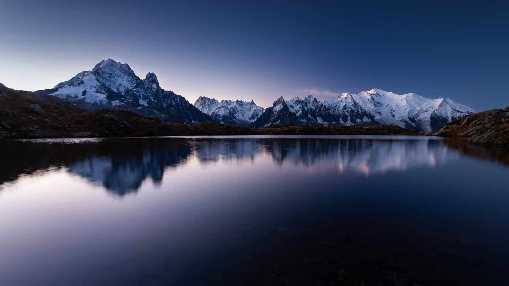

# “Оптимізація зображень за допомогою Squoosh”

## Початкові зображеня

| Назва зображення | Формат зображення | Розмір зображення | Вага зображення |
|------------------|-------------------|-------------------|-----------------|
| picture1         | png               | 1080x1013         | 881 Kb          |
| picture2         | jpg               | 1280x720          | 110 Kb          |
| picture3         | jpg               | 2000x2000         | 267 Kb          |

#### picture1:

#### picture2:

#### picture3:

---

## Lossless

### WebP

| Назва зображення | Формат зображення | Розмір зображення | Вага зображення | Зміна   |
|------------------|-------------------|-------------------|-----------------|---------|
| picture1         | webp              | 1080x1013         | 501 Kb          | -43%    |
| picture2         | webp              | 1280x720          | 624 Kb          | +467%   |
| picture3         | webp              | 2000x2000         | 792 Kb          | +196%   |

#### picture1:

#### picture2:

#### picture3:

---

### Png

| Назва зображення | Формат зображення | Розмір зображення | Вага зображення | Зміна |
|------------------|-------------------|-------------------|-----------------|-------|
| picture1         | png               | 1080x1013         | 1.04 Mb         | +18%  |
| picture2         | png               | 1280x720          | 1.12 Mb         | +918% |
| picture3         | png               | 2000x2000         | 1.45 Mb         | +443% |

#### picture1:

#### picture2:

#### picture3:

---

## Lossy

### MozJPEG (100% quality)

| Назва зображення | Формат зображення | Розмір зображення | Вага зображення | Зміна |
|------------------|-------------------|-------------------|-----------------|-------|
| picture1         | jpg               | 1080x1013         | 497 Kb          | -44%  |
| picture2         | jpg               | 1280x720          | 327 Kb          | +197% |
| picture3         | jpg               | 2000x2000         | 543 Kb          | +103% |

#### picture1:

#### picture2:

#### picture3:

---

### MozJPEG (75% quality)

| Назва зображення | Формат зображення | Розмір зображення | Вага зображення | Зміна |
|------------------|-------------------|-------------------|-----------------|-------|
| picture1         | jpg               | 1080x1013         | 84.4 Kb         | -90%  |
| picture2         | jpg               | 1280x720          | 74.9 Kb         | -32%  |
| picture3         | jpg               | 2000x2000         | 140 Kb          | -48%  |

#### picture1:

#### picture2:

#### picture3:

---

### MozJPEG (50% quality)

| Назва зображення | Формат зображення | Розмір зображення | Вага зображення | Зміна |
|------------------|-------------------|-------------------|-----------------|-------|
| picture1         | jpg               | 1080x1013         | 50.8 Kb         | -94%  |
| picture2         | jpg               | 1280x720          | 42.2 Kb         | -62%  |
| picture3         | jpg               | 2000x2000         | 96.4 Kb         | -64%  |

#### picture1:

#### picture2:

#### picture3:

---

### MozJPEG (min quality with nice picture)

| Назва зображення | Формат зображення | Розмір зображення | Вага зображення | Зміна | Якість |
|------------------|-------------------|-------------------|-----------------|-------|--------|
| picture1         | jpg               | 1080x1013         | 27.7 Kb         | -97%  | 25%    |
| picture2         | jpg               | 1280x720          | 27.2 Kb         | -75%  | 30%    |
| picture3         | jpg               | 2000x2000         | 44.9 Kb         | -83%  | 15%    |

#### picture1:

#### picture2:

#### picture3:

---

### WebP (100% quality)

| Назва зображення | Формат зображення | Розмір зображення | Вага зображення | Зміна |
|------------------|-------------------|-------------------|-----------------|-------|
| picture1         | webp              | 1080x1013         | 251 Kb          | -72%  |
| picture2         | webp              | 1280x720          | 196 Kb          | +78%  |
| picture3         | webp              | 2000x2000         | 278 Kb          | +4%   |

#### picture1:

#### picture2:

#### picture3:

---

### WebP (75% quality)

| Назва зображення | Формат зображення | Розмір зображення | Вага зображення | Зміна |
|------------------|-------------------|-------------------|-----------------|-------|
| picture1         | webp              | 1080x1013         | 60.4 Kb         | -93%  |
| picture2         | webp              | 1280x720          | 50.4 Kb         | -54%  |
| picture3         | webp              | 2000x2000         | 81.9 Kb         | -69%  |

#### picture1:

#### picture2:

#### picture3:

--- 

### WebP (50% quality)

| Назва зображення | Формат зображення | Розмір зображення | Вага зображення | Зміна |
|------------------|-------------------|-------------------|-----------------|-------|
| picture1         | webp              | 1080x1013         | 44.4 Kb         | -95%  |
| picture2         | webp              | 1280x720          | 36 Kb           | -67%  |
| picture3         | webp              | 2000x2000         | 63.6 Kb         | -76%  |

#### picture1:

#### picture2:

#### picture3:

--- 

### WebP (min quality with nice picture)

| Назва зображення | Формат зображення | Розмір зображення | Вага зображення | Зміна | Якість |
|------------------|-------------------|-------------------|-----------------|-------|--------|
| picture1         | webp              | 1080x1013         | 25.7 Kb         | -97%  | 20%    |
| picture2         | webp              | 1280x720          | 19.6 Kb         | -82%  | 17%    |
| picture3         | webp              | 2000x2000         | 26.4 Kb         | -90%  | 0%     |

#### picture1:

#### picture2:

#### picture3:

---

### AVIF (100%)

| Назва зображення | Формат зображення | Розмір зображення | Вага зображення | Зміна |
|------------------|-------------------|-------------------|-----------------|-------|
| picture1         | avif              | 1080x1013         | 237 Kb          | -73%  |
| picture2         | avif              | 1280x720          | 162 Kb          | +47%  |
| picture3         | avif              | 2000x2000         | 285 Kb          | +7%   |

#### picture1:

#### picture2:

#### picture3:

---

### AVIF (75%)

| Назва зображення | Формат зображення | Розмір зображення | Вага зображення | Зміна |
|------------------|-------------------|-------------------|-----------------|-------|
| picture1         | avif              | 1080x1013         | 78.6 Kb         | -91%  |
| picture2         | avif              | 1280x720          | 67 Kb           | -39%  |
| picture3         | avif              | 2000x2000         | 84.2 Kb         | -68%  |

#### picture1:

#### picture2:

#### picture3:

---

### AVIF (50%)

| Назва зображення | Формат зображення | Розмір зображення | Вага зображення | Зміна |
|------------------|-------------------|-------------------|-----------------|-------|
| picture1         | avif              | 1080x1013         | 36.4 Kb         | -96%  |
| picture2         | avif              | 1280x720          | 30.6 Kb         | -72%  |
| picture3         | avif              | 2000x2000         | 38.9 Kb         | -85%  |

#### picture1:

#### picture2:

#### picture3:

---

### AVIF (min quality with nice picture)

| Назва зображення | Формат зображення | Розмір зображення | Вага зображення | Зміна | Якість |
|------------------|-------------------|-------------------|-----------------|-------|--------|
| picture1         | avif              | 1080x1013         | 9.14 Kb         | -99%  | 20%    |
| picture2         | avif              | 1280x720          | 13.6 Kb         | -88%  | 30%    |
| picture3         | avif              | 2000x2000         | 10.2 Kb         | -96%  | 5%     |

#### picture1:

#### picture2:

#### picture3:

---

## Зміна розмірів вхідних зображень

### Для вебу (максимальна ширина 1200px)

| Назва зображення | Формат зображення | Розмір зображення | Вага зображення | Зміна |
|------------------|-------------------|-------------------|-----------------|-------|
| picture1         | jpg               | 1200x675          | 66.5 Kb         | -92%  |
| picture2         | jpg               | 1200x675          | 94.3 Kb         | -14%  |
| picture3         | jpg               | 1200x1200         | 106 Kb          | -60%  |

#### picture1:

#### picture2:

#### picture3:

---

### Для мобільних пристроїв (максимальна ширина 600px)

| Назва зображення | Формат зображення | Розмір зображення | Вага зображення | Зміна |
|------------------|-------------------|-------------------|-----------------|-------|
| picture1         | jpg               | 600x338           | 21.8 Kb         | -98%  |
| picture2         | jpg               | 600x338           | 32.8 Kb         | -70%  |
| picture3         | jpg               | 600x600           | 43.2 Kb         | -84%  |

#### picture1:

#### picture2:

#### picture3:

---

### Для Retina-дисплеїв (2x версія зображення)

| Назва зображення | Формат зображення | Розмір зображення | Вага зображення | Зміна |
|------------------|-------------------|-------------------|-----------------|-------|
| picture1         | jpg               | 3600x2026         | 347 Kb          | -61%  |
| picture2         | jpg               | 2560x1440         | 246 Kb          | +123% |
| picture3         | jpg               | 4000x4000         | 484 Kb          | +81%  |

#### picture1:

#### picture2:

#### picture3:

---

## Висновки

Як висновок, можу зазначити те, що для різних зображень найкраще підходять різні 
формати та параметри оптимізації.

Для третього зображення найоптимальнішим форматом став формат AVIF, адже саме він зміг
стиснути зображення без сильної втрати якості так, щоб зміна ваги відносно вхідного зображення 
була -96%

Для другого зображення найоптимальнішим форматом став також формат AVIF. Саме він зміг
забезпечити зміну ваги -88% відносно вхідного зображення.

Для першого зображення найоптимальнішим форматом став знову ж таки формат AVIF.
Зміна ваги в цьому випадку досягла -99%.

Також треба зазначити, що зміна розміру зображення також чудово впливає на його вагу, тому
найкращий спосіб оптимізації зображення - це комбінувати зміну формату та зміну розміру зображення.