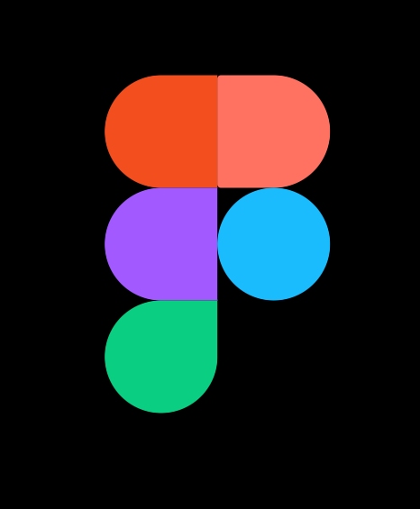
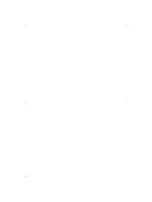

# “Моделювання логотипа в Figma”

Виконане завдання можна знайти за посиланням: 
https://www.figma.com/design/SfMarNkXOQXBpL3AmHXVw6/PZ2?node-id=0-1&t=xAV1NptSFDt58pRZ-1

## План виконання роботи

1. Створити фрейм
2. Створити 5 Rectangles та розмістити їх на фреймі
3. Налаштувати закруглення кутів у Rectangles
4. Покрасити Rectangles у відповідні кольори

## Результат

## Додаткове завдання

Було вирішено "погратися" з анімаціями та спробувати створити анімацію
появлення логотипа.

### План виконання додаткового завдання

1. Скопіювати фрейм
2. Зменшити Rectangles до мінімального розміру
3. Зв'язати новостворенний фрейм з початковим та налаштувати анімацію
4. Запустити та насолодитися результатом

### Результат додаткового завдання

