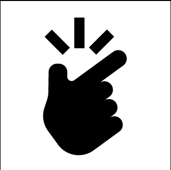
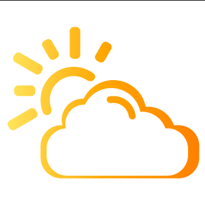
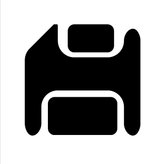

# Завдання 5

Виконане завдання можна знайти за посиланням:
https://www.figma.com/design/r47C2e29TZu39khnxjfl3E/PZ5?node-id=0-1&t=HKTTlacx3OdRJ68B-1

## Іконка 1

### Ідея 

Створити щось накшталт долоні, що робить клацання пальцями.

### Результат

## Іконка 2

### Ідея

Створити хмару поза якої виглядає сонце

### Результат

## Іконка 3

### Ідея

Створити іконку "Зберегти"

### Результат

