# Завдання 9

Тема: “Дослідження кольорових гармоній та інструментів аналізу кольору в Adobe Color”

## Практичне завдання

### Вибрати базовий колір

Базовий колір: #E06745

### Створіть палітри для кожного типу гармонії

#### Analogous

Скріншот палітри:

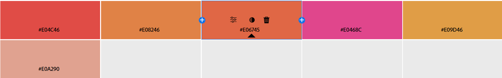

##### Опис: 

Аналогова гармонія використовує кольори, що знаходяться поруч із базовим кольором на колірному колі, 
зазвичай у межах 30°. Це створює м’яке, природне поєднання, яке виглядає гармонійно і не контрастно.

##### Ефект:

Таке поєднання викликає відчуття тепла, затишку та єдності, 
ідеально для створення спокійного, але енергійного дизайну.

#### Monochromatic

Скріншот палітри:

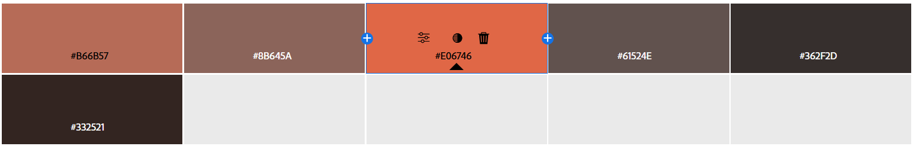

##### Опис:

Монохроматична гармонія базується на одному кольорі, але з різними відтінками, тонами та насиченістю 
(змінюємо яскравість і насиченість базового кольору). Це створює чистий, мінімалістичний вигляд.

##### Ефект:

Монохроматична палітра виглядає елегантно і стримано, викликаючи відчуття стабільності та простоти, 
але може бути менш динамічною.

#### Triad

Скріншот палітри:

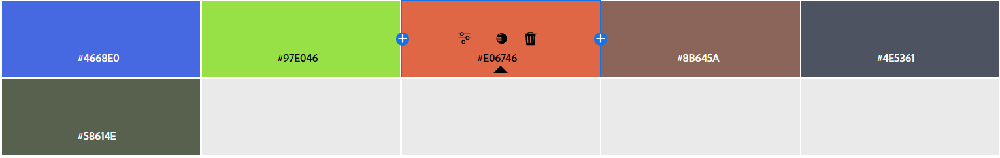

##### Опис:

Тріадична гармонія використовує три кольори, що рівномірно розподілені на колірному колі (кожен на 120° від іншого). 
Це створює яскраве, збалансоване поєднання з високим контрастом.

##### Ефект:

Тріада створює жвавий, енергійний вигляд із сильним контрастом, що викликає відчуття динаміки та різноманітності, 
але потребує обережного балансу.

#### Complementary

Скріншот палітри:

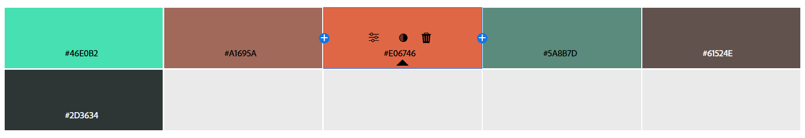

##### Опис:

Комплементарна гармонія використовує два кольори, що знаходяться один навпроти одного на колірному колі (180°). 
Це створює сильний контраст і максимальну візуальну напругу.

##### Ефект:

Поєднання теплого помаранчевого з прохолодним блакитним створює яскравий, привабливий контраст, 
що викликає увагу та відчуття рівноваги між теплом і прохолодою.

#### Split Complementary

Скріншот палітри:

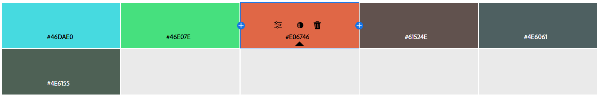

##### Опис:

Розділена комплементарна гармонія бере комплементарний колір (180°) і додає два кольори, що знаходяться поруч із ним (±30° від комплементарного).
Це дає контраст, але м’якший, ніж у чистій комплементарній гармонії.

##### Ефект:

Це поєднання зберігає контраст, але виглядає менш напруженим, ніж комплементарна гармонія, 
створюючи збалансований і приємний для ока вигляд.

#### Square

Скріншот палітри:

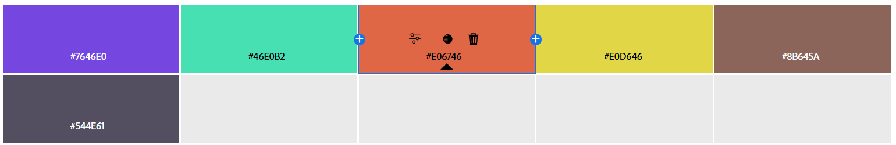

##### Опис:

Квадратна гармонія використовує чотири кольори, що розташовані на колірному колі на рівній відстані (по 90°). 
Це створює багате, контрастне поєднання.

##### Ефект:

Квадратна гармонія виглядає дуже різноманітно і яскраво, викликаючи відчуття динаміки та багатства,
але може бути складною для гармонійного використання.

#### Custom

Скріншот палітри:

##### Опис:

Кастомна гармонія не прив’язана до строгих правил колірного кола. Вибираємо кольори на основі бажаного емоційного ефекту, стилю чи інтуїції.

##### Ефект:

Кастомна палітра може бути унікальною і підкреслювати індивідуальність дизайну, викликаючи потрібний настрій.

### Створення палітри зображенням

Завантажене зображення:

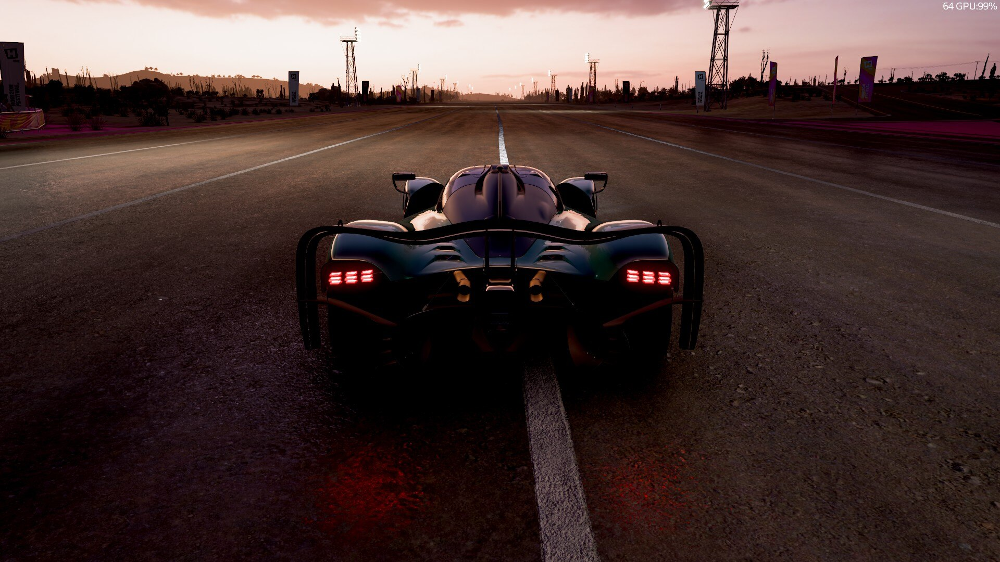

#### Colorful Mod

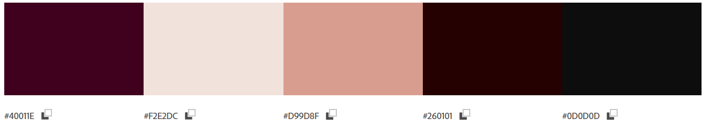

#### Muted Mod

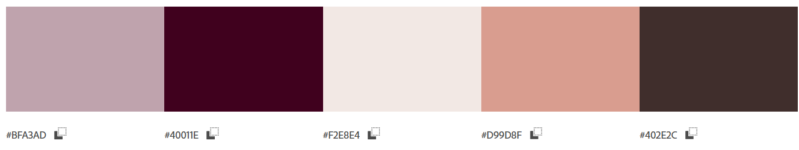

Для створення додатку, пов’язаного з автівкою на зображенні, краще обрати Colorful Mod.

Чому?
- Краще відображає елегантний, драматичний настрій зображення завдяки темним тонам (#4001E, #260101, #0D0D0D), які гармоніюють із кольором автівки та дороги.
- #D99D8F (персиковий) підкреслює теплі відтінки заходу сонця, додаючи м’якості, а #F2E2DC забезпечує нейтральний фон для читабельності тексту.
- Ця палітра виглядає більш стриманою і професійною, що підходить для додатку, пов’язаного з автотематикою, особливо якщо він орієнтований на серйозну аудиторію (наприклад, автоспорт, преміум-авто).

#### Створення градієнту на основі зображення

Завантажене зображення:

Отриманий градієнт:

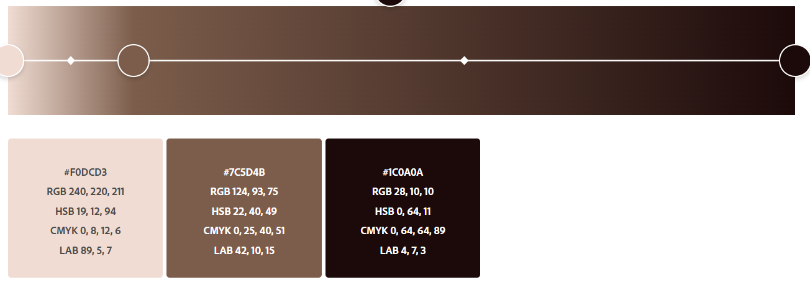

#### Аналіз контрасту

За основу вызьмемо два кольору з палытри, яку ми отримали з зображення, я саме:

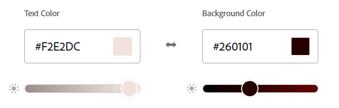

Рівень контрастності:
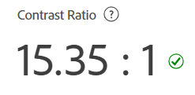

Перевірки для текстів та іконок:

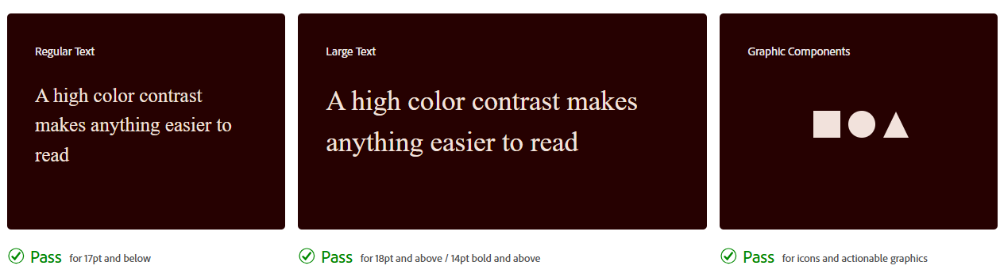

## Висновок

Загалом, створення палітр для інтерфейсів та іконок вимагає врахування гармонії кольорів, емоційного впливу і функціональності. 
Аналогові та монохроматичні гармонії ідеальні для спокійних, зручних дизайнів, тоді як тріадичні чи комплементарні підходять для 
динамічних і привабливих рішень. Вибір палітри залежить від цільової аудиторії та настрою проєкту: стримані палітри з темними і 
нейтральними тонами підходять для професійних інтерфейсів, а яскраві акценти додають сучасності і 
привертають увагу в більш креативних дизайнах.